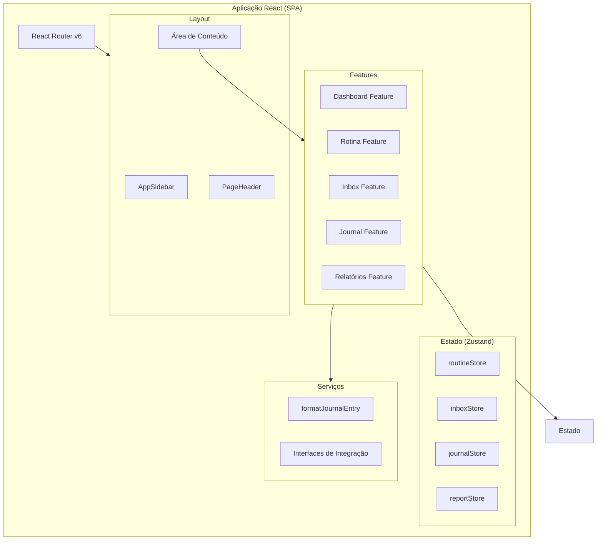

# Design Document - Work Journal

## Overview

O Work Journal é uma aplicação frontend SPA (Single Page Application) construída com React + TypeScript + Vite, destinada a desenvolvedores que desejam registrar suas atividades diárias e gerar relatórios profissionais automaticamente. A aplicação utiliza arquitetura feature-first, gerenciamento de estado com Zustand, estilização com TailwindCSS e componentes do shadcn/ui, sem dependência de backend — todos os dados são mockados localmente.

A aplicação é composta por cinco módulos principais:
- **Dashboard**: Visão geral com estatísticas e resumo do dia
- **Minha Rotina**: Gerenciamento de atividades recorrentes
- **Inbox**: Captura rápida de tarefas avulsas
- **Journal**: Registro em texto livre com formatação profissional automática
- **Relatórios**: Geração de relatórios agrupados por período

A interface segue tema escuro por padrão, com estilo minimalista inspirado em Linear/Notion/GitHub/Raycast.

## Architecture

### Diagrama de Alto Nível



### Decisões Arquiteturais

| Decisão | Escolha | Justificativa |
|---------|---------|---------------|
| Roteamento | React Router v6 | Navegação SPA sem reload, suporte a lazy loading |
| Estado | Zustand (stores modulares) | Leve, sem boilerplate, stores independentes por feature |
| Formulários | React Hook Form + Zod | Validação declarativa com tipagem forte |
| Estilização | TailwindCSS + shadcn/ui | Componentização consistente, tema escuro nativo |
| Ícones | Lucide Icons | Leve, consistente com shadcn/ui |
| Testes | Jest + React Testing Library | Padrão do ecossistema React, foco em behavior testing |
| Build | Vite | HMR rápido, build otimizado, suporte TypeScript nativo |

### Estrutura de Diretórios

```
src/
├── app/
│   ├── App.tsx
│   ├── router.tsx
│   └── providers.tsx
├── components/           # Componentes compartilhados
│   ├── AppSidebar.tsx
│   ├── PageHeader.tsx
│   ├── EmptyState.tsx
│   ├── Loading.tsx
│   ├── Button.tsx
│   ├── Modal.tsx
│   ├── Input.tsx
│   ├── Textarea.tsx
│   └── Badge.tsx
├── features/
│   ├── dashboard/
│   │   ├── components/
│   │   │   └── StatCard.tsx
│   │   ├── pages/
│   │   │   └── DashboardPage.tsx
│   │   ├── hooks/
│   │   ├── services/
│   │   ├── types/
│   │   └── tests/
│   ├── routine/
│   │   ├── components/
│   │   │   └── RoutineCard.tsx
│   │   ├── pages/
│   │   │   └── RoutinePage.tsx
│   │   ├── hooks/
│   │   │   └── useRoutineStore.ts
│   │   ├── services/
│   │   ├── types/
│   │   │   └── routine.types.ts
│   │   └── tests/
│   │       └── RoutineCard.test.tsx
│   ├── inbox/
│   │   ├── components/
│   │   │   └── InboxItem.tsx
│   │   ├── pages/
│   │   │   └── InboxPage.tsx
│   │   ├── hooks/
│   │   │   └── useInboxStore.ts
│   │   ├── services/
│   │   ├── types/
│   │   │   └── inbox.types.ts
│   │   └── tests/
│   │       └── InboxItem.test.tsx
│   ├── journal/
│   │   ├── components/
│   │   │   ├── JournalEditor.tsx
│   │   │   └── JournalCard.tsx
│   │   ├── pages/
│   │   │   └── JournalPage.tsx
│   │   ├── hooks/
│   │   │   └── useJournalStore.ts
│   │   ├── services/
│   │   │   └── formatJournalEntry.ts
│   │   ├── types/
│   │   │   └── journal.types.ts
│   │   └── tests/
│   │       └── formatJournalEntry.test.ts
│   └── reports/
│       ├── components/
│       │   └── ReportViewer.tsx
│       ├── pages/
│       │   └── ReportsPage.tsx
│       ├── hooks/
│       │   └── useReportStore.ts
│       ├── services/
│       ├── types/
│       │   └── report.types.ts
│       └── tests/
├── services/             # Interfaces de integração futura
│   ├── openai.service.ts
│   ├── jira.service.ts
│   ├── github.service.ts
│   ├── gitlab.service.ts
│   └── teams.service.ts
├── styles/
│   └── globals.css
└── lib/
    └── utils.ts
```

## Components and Interfaces

### Componentes Compartilhados

#### AppSidebar

```typescript
interface AppSidebarProps {
  currentPath: string;
}
```

Renderiza a barra lateral fixa com os itens de navegação na ordem: Dashboard, Minha Rotina, Inbox, Journal, Relatórios, Configurações. Cada item possui ícone (Lucide) e label. O item ativo é destacado visualmente.

#### PageHeader

```typescript
interface PageHeaderProps {
  title: string;
  description?: string;
  actions?: React.ReactNode;
}
```

Header reutilizável para cada página, com título, descrição opcional e área para ações (botões).

#### EmptyState

```typescript
interface EmptyStateProps {
  icon?: React.ReactNode;
  title: string;
  description: string;
  action?: {
    label: string;
    onClick: () => void;
  };
}
```

Componente exibido quando uma lista está vazia, com ícone, mensagem e ação opcional.

#### Input

```typescript
interface InputProps extends React.InputHTMLAttributes<HTMLInputElement> {
  label?: string;
  error?: string;
}
```

#### Textarea

```typescript
interface TextareaProps extends React.TextareaHTMLAttributes<HTMLTextAreaElement> {
  label?: string;
  error?: string;
  minHeight?: string;
}
```

#### Badge

```typescript
interface BadgeProps {
  variant: 'default' | 'success' | 'warning' | 'destructive';
  children: React.ReactNode;
}
```

### Componentes de Feature

#### RoutineCard

```typescript
interface RoutineCardProps {
  routine: Routine;
  onToggleComplete: (id: string) => void;
}
```

Exibe uma rotina com título, badge de frequência e checkbox de conclusão. Aplica estilo visual de conclusão (opacidade reduzida, texto riscado) quando marcada.

#### InboxItem

```typescript
interface InboxItemProps {
  task: InboxTask;
  onToggleComplete: (id: string) => void;
  onEdit: (id: string, text: string) => void;
  onDelete: (id: string) => void;
}
```

Item individual do Inbox com ações de completar, editar e excluir.

#### JournalEditor

```typescript
interface JournalEditorProps {
  onSave: (text: string) => void;
  isLoading?: boolean;
}
```

Campo de texto grande com botão "Salvar". Desabilita o botão quando o texto está vazio ou contém apenas espaços.

#### JournalCard

```typescript
interface JournalCardProps {
  entry: JournalEntry;
}
```

Exibe uma entrada do journal mostrando texto original e texto formatado, com data de criação.

#### ReportViewer

```typescript
interface ReportViewerProps {
  entries: JournalEntry[];
  period: ReportPeriod;
}
```

Renderiza o relatório com título do período, seções agrupadas por data e texto formatado.

#### StatCard

```typescript
interface StatCardProps {
  title: string;
  value: string | number;
  icon: React.ReactNode;
  trend?: 'up' | 'down' | 'neutral';
}
```

### Interfaces de Serviço (Integrações Futuras)

```typescript
// services/openai.service.ts
export interface OpenAIService {
  formatText(input: string): Promise<string>;
  summarize(entries: string[]): Promise<string>;
}

// services/jira.service.ts
export interface JiraService {
  getMyTasks(): Promise<JiraTask[]>;
  syncRoutines(routines: Routine[]): Promise<void>;
}

// services/github.service.ts
export interface GitHubService {
  getCommits(since: Date): Promise<GitHubCommit[]>;
  getPullRequests(state: 'open' | 'closed' | 'all'): Promise<GitHubPR[]>;
}

// services/gitlab.service.ts
export interface GitLabService {
  getMergeRequests(since: Date): Promise<GitLabMR[]>;
  getCommits(since: Date): Promise<GitLabCommit[]>;
}

// services/teams.service.ts
export interface TeamsService {
  sendReport(report: string, channel: string): Promise<void>;
  getStatus(): Promise<TeamsStatus>;
}
```

### Formatador Journal

```typescript
// features/journal/services/formatJournalEntry.ts
export async function formatJournalEntry(rawText: string): Promise<string>;
```

Interface assíncrona (retorna `Promise<string>`) para permitir substituição futura por chamada à API OpenAI. A implementação mock atual é uma função pura síncrona envolvida em `Promise.resolve()`, que transforma o texto em linguagem profissional sem efeitos colaterais.

**Regras da implementação mock:**
- Aceita string não vazia como parâmetro
- Retorna string formatada em linguagem profissional
- Sem efeitos colaterais
- Sem dependências externas
- O texto original DEVE ser preservado inalterado na Entrada_Journal (propriedade round-trip)

## Data Models

### Tipos Principais

```typescript
// features/routine/types/routine.types.ts
export type Frequency = 'daily' | 'weekly' | 'sprint';

export interface Routine {
  id: string;
  title: string;
  frequency: Frequency;
  completed: boolean;
  createdAt: string; // ISO 8601
}

// features/inbox/types/inbox.types.ts
export interface InboxTask {
  id: string;
  text: string;
  completed: boolean;
  createdAt: string; // ISO 8601
  updatedAt: string; // ISO 8601
}

// features/journal/types/journal.types.ts
export interface JournalEntry {
  id: string;
  rawText: string;        // Texto original do usuário
  formattedText: string;  // Texto formatado pelo Formatador_Journal
  createdAt: string;      // ISO 8601
}

// features/reports/types/report.types.ts
export type ReportPeriod = 'today' | 'week' | 'sprint';

export interface ReportSection {
  date: string;           // ISO 8601 date (YYYY-MM-DD)
  entries: JournalEntry[];
}

export interface Report {
  period: ReportPeriod;
  title: string;
  sections: ReportSection[];
  generatedAt: string;    // ISO 8601
}
```

### Zustand Stores

```typescript
// features/routine/hooks/useRoutineStore.ts
interface RoutineState {
  routines: Routine[];
  addRoutine: (title: string, frequency: Frequency) => void;
  toggleRoutine: (id: string) => void;
  removeRoutine: (id: string) => void;
}

// features/inbox/hooks/useInboxStore.ts
interface InboxState {
  tasks: InboxTask[];
  addTask: (text: string) => void;
  toggleTask: (id: string) => void;
  editTask: (id: string, text: string) => void;
  removeTask: (id: string) => void;
}

// features/journal/hooks/useJournalStore.ts
interface JournalState {
  entries: JournalEntry[];
  addEntry: (rawText: string, formattedText: string) => void;
  getEntriesByPeriod: (period: ReportPeriod) => JournalEntry[];
}

// features/reports/hooks/useReportStore.ts
interface ReportState {
  selectedPeriod: ReportPeriod;
  setSelectedPeriod: (period: ReportPeriod) => void;
  generateReport: (entries: JournalEntry[], period: ReportPeriod) => Report;
}
```

### Validação com Zod

```typescript
import { z } from 'zod';

export const routineSchema = z.object({
  title: z.string()
    .min(1, 'O título é obrigatório')
    .max(100, 'O título deve ter no máximo 100 caracteres')
    .refine(val => val.trim().length > 0, 'O título não pode conter apenas espaços'),
  frequency: z.enum(['daily', 'weekly', 'sprint']),
});

export const inboxTaskSchema = z.object({
  text: z.string()
    .min(1, 'O texto é obrigatório')
    .max(200, 'O texto deve ter no máximo 200 caracteres')
    .refine(val => val.trim().length > 0, 'O texto não pode conter apenas espaços'),
});

export const journalEntrySchema = z.object({
  rawText: z.string()
    .min(1, 'O texto é obrigatório')
    .refine(val => val.trim().length > 0, 'O texto não pode conter apenas espaços'),
});
```

## Correctness Properties

*Uma propriedade é uma característica ou comportamento que deve ser verdadeiro em todas as execuções válidas de um sistema — essencialmente, uma declaração formal sobre o que o sistema deve fazer. Propriedades servem como a ponte entre especificações legíveis por humanos e garantias de corretude verificáveis por máquina.*

### Property 1: Rejeição de entrada whitespace-only

*Para qualquer* string composta inteiramente por caracteres de espaço em branco (espaços, tabs, quebras de linha) de qualquer comprimento, o schema de validação SHALL rejeitar a entrada e impedir a criação de registro (Rotina, Tarefa_Inbox ou Entrada_Journal).

**Validates: Requirements 2.2, 3.3, 4.3**

### Property 2: Criação com entrada válida preserva dados

*Para qualquer* string válida (não vazia, não whitespace-only, respeitando limites de caracteres) e qualquer frequência válida (daily/weekly/sprint), a criação de um registro SHALL resultar em um novo item no store cujos campos correspondem exatamente aos valores de entrada fornecidos.

**Validates: Requirements 2.1, 3.2**

### Property 3: Toggle de conclusão é round-trip

*Para qualquer* Rotina ou Tarefa_Inbox em qualquer estado (pendente ou concluída), alternar o estado de conclusão duas vezes consecutivas SHALL restaurar o item ao seu estado original de conclusão.

**Validates: Requirements 2.4, 2.5**

### Property 4: Ordenação cronológica decrescente

*Para qualquer* lista de Tarefas_Inbox ou Entradas_Journal com timestamps distintos, a exibição SHALL apresentar os itens ordenados do mais recente para o mais antigo, onde cada item na posição N tem createdAt >= item na posição N+1.

**Validates: Requirements 3.4, 4.8**

### Property 5: Exclusão remove exatamente um item

*Para qualquer* lista de Tarefas_Inbox com N itens e qualquer tarefa existente selecionada para exclusão, após a remoção a lista SHALL conter exatamente N-1 itens e a tarefa removida SHALL não estar presente na lista resultante.

**Validates: Requirements 3.7**

### Property 6: Preservação do texto original (round-trip)

*Para qualquer* texto válido salvo no Journal, o campo rawText da Entrada_Journal resultante SHALL ser idêntico (byte a byte) ao texto original fornecido pelo usuário, independentemente da transformação aplicada pelo Formatador_Journal ao campo formattedText.

**Validates: Requirements 4.7**

### Property 7: Formatador Journal — transparência referencial e output não-vazio

*Para qualquer* string válida (não vazia, não whitespace-only) fornecida ao formatJournalEntry, a função SHALL retornar sempre a mesma string não-vazia quando chamada múltiplas vezes com o mesmo input, e o output SHALL ser diferente de string vazia.

**Validates: Requirements 4.5, 7.5**

### Property 8: Filtragem por período retorna apenas entradas dentro do intervalo

*Para qualquer* conjunto de Entradas_Journal com datas variadas e qualquer período selecionado (today/week/sprint), o relatório gerado SHALL conter exclusivamente entradas cujo createdAt está dentro do intervalo do período, agrupadas por data e ordenadas cronologicamente do mais recente para o mais antigo.

**Validates: Requirements 5.3, 5.4**

## Error Handling

### Estratégia de Tratamento de Erros

| Cenário | Tratamento | Feedback ao Usuário |
|---------|------------|---------------------|
| Validação de formulário falha (título vazio, whitespace-only) | Zod schema rejeita, React Hook Form exibe erro | Mensagem inline abaixo do campo com texto descritivo |
| Texto excede limite de caracteres | `maxLength` no input + validação Zod | Campo não aceita mais caracteres, contador visível |
| formatJournalEntry recebe input inválido | Guard clause retorna texto original como fallback | Nenhum — texto original é preservado silenciosamente |
| Store não inicializado | Zustand inicializa com estado padrão (arrays vazios) | EmptyState component é exibido |
| Rota não encontrada | React Router catch-all route | Página 404 com link para Dashboard |
| Erro inesperado em componente | React Error Boundary | Mensagem genérica com opção de recarregar |

### Validação em Camadas

```
┌─────────────────────────────┐
│  UI Layer (maxLength, disabled) │  ← Prevenção imediata
├─────────────────────────────┤
│  Form Layer (React Hook Form)   │  ← Validação on-submit
├─────────────────────────────┤
│  Schema Layer (Zod)             │  ← Validação tipada
├─────────────────────────────┤
│  Store Layer (Guard clauses)    │  ← Última defesa
└─────────────────────────────┘
```

### Padrão de Erro nos Componentes

```typescript
// Padrão para campos de entrada com validação
interface FormFieldError {
  message: string;
  type: 'required' | 'maxLength' | 'whitespace';
}
```

Os erros de validação são exibidos inline, com estilo de texto em vermelho (`text-destructive`), imediatamente abaixo do campo correspondente. O formulário não é submetido enquanto houver erros de validação ativos.

### Fallback do Formatador

Caso o `formatJournalEntry` falhe em produzir output (cenário futuro com API externa), o sistema deve:
1. Armazenar o `rawText` normalmente
2. Usar o `rawText` como `formattedText` temporário
3. Registrar o erro para debugging (console.error no MVP)

## Testing Strategy

### Abordagem Dual: Testes Unitários + Testes de Propriedade

A estratégia de testes combina duas abordagens complementares:

- **Testes unitários** (Jest + RTL): Verificam exemplos específicos, edge cases e interações de UI
- **Testes de propriedade** (fast-check): Verificam propriedades universais através de inputs gerados aleatoriamente

### Biblioteca de Property-Based Testing

- **Biblioteca**: [fast-check](https://github.com/dubzzz/fast-check) — biblioteca PBT madura para TypeScript/JavaScript
- **Configuração**: Mínimo de 100 iterações por property test
- **Integração**: Executa dentro do Jest com `fc.assert(fc.property(...))`

### Testes Unitários (Jest + React Testing Library)

| Componente/Função | Cenários Mínimos |
|-------------------|------------------|
| RoutineCard | Renderiza corretamente com dados; Aplica estilo de conclusão |
| InboxItem | Renderiza com ações; Aplica line-through quando concluída |
| formatJournalEntry | Formata texto simples; Lida com texto multilinha |
| Dashboard (StatCard) | Renderiza estatísticas; Exibe EmptyState quando vazio |
| AppSidebar | Renderiza itens na ordem correta; Destaca item ativo |

### Testes de Propriedade (fast-check)

Cada property test referencia diretamente uma propriedade do design document:

| Property | Tag | Iterações |
|----------|-----|-----------|
| Property 1: Rejeição whitespace | `Feature: work-journal, Property 1: Whitespace rejection` | 100 |
| Property 2: Criação preserva dados | `Feature: work-journal, Property 2: Valid input creation` | 100 |
| Property 3: Toggle round-trip | `Feature: work-journal, Property 3: Toggle round-trip` | 100 |
| Property 4: Ordenação cronológica | `Feature: work-journal, Property 4: Chronological ordering` | 100 |
| Property 5: Exclusão remove um item | `Feature: work-journal, Property 5: Delete removes one` | 100 |
| Property 6: Preservação rawText | `Feature: work-journal, Property 6: RawText preservation` | 100 |
| Property 7: Formatador transparência referencial | `Feature: work-journal, Property 7: Formatter referential transparency` | 100 |
| Property 8: Filtragem por período | `Feature: work-journal, Property 8: Period filtering` | 100 |

### Exemplo de Property Test

```typescript
import fc from 'fast-check';
import { formatJournalEntry } from './formatJournalEntry';

// Feature: work-journal, Property 7: Formatter referential transparency
describe('formatJournalEntry - referential transparency', () => {
  it('should always return the same non-empty output for the same input', () => {
    fc.assert(
      fc.property(
        fc.string({ minLength: 1 }).filter(s => s.trim().length > 0),
        async (input) => {
          const result1 = await formatJournalEntry(input);
          const result2 = await formatJournalEntry(input);
          expect(result1).toBe(result2);
          expect(result1.length).toBeGreaterThan(0);
        }
      ),
      { numRuns: 100 }
    );
  });
});
```

### Estrutura de Testes por Feature

```
src/features/{feature}/tests/
├── {Component}.test.tsx        # Testes unitários de componente
├── {store}.test.ts             # Testes unitários do store
└── {feature}.property.test.ts  # Testes de propriedade
```

### Coverage Goals

- Funções de lógica pura (formatJournalEntry, validação): 100% via property tests
- Componentes de UI: Testes de renderização e interação principais
- Stores: Testes de actions e state transitions
- Integração: Fluxos principais end-to-end (capturar → salvar → gerar relatório)

